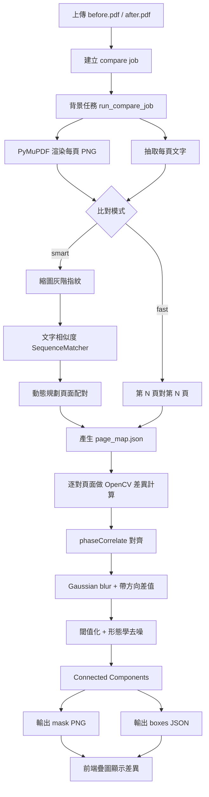

# PDF Compare

上傳兩份 PDF，自動標出所有差異位置——文字修改、內容增刪、段落移位，一目了然。

---

## 這個系統解決什麼痛點

審閱合約、規格書、報告的修訂版本時，傳統做法是人工逐頁肉眼比對，費時且容易遺漏細節。

**PDF Compare 提供完全本機運行的解決方案**，不需要帳號、不需要網路、資料不離開自己的電腦，且對任意 PDF（包含掃描檔）均有效。

---

## 能做什麼

- **精確標出差異位置**：在頁面圖像上以方向性遮罩標示差異，區分「左有右無」與「右有左無」
- **處理插頁∕刪頁**（`smart` 模式）：兩份文件頁數不同時，自動找出對應關係，不會因為插了一頁就讓後續全部錯位
- **比對任何 PDF**：無論是可複製文字的 PDF 或純掃描影像，都能比對
- **非同步背景處理**：上傳後立即取得進度，大型文件比對期間不阻塞前端
- **統計摘要**：比對完成後提供新增頁數、刪除頁數、頁級差異清單等資訊
- **LLM 前處理**：先篩出值得送 LLM 的候選頁，避免整份長文件直接丟給模型造成 token 過大

---

## 運作原理

### 第一步：PDF → 圖像

使用 **PyMuPDF** 將每一頁 PDF 渲染成高解析度 PNG（目前預設 240 DPI），確保掃描檔與純文字檔使用相同的處理流程。

### 第二步：頁面配對

根據選擇的模式決定「哪一頁對哪一頁」：

**Fast 模式**（第 N 頁對第 N 頁）

直接以序號配對。適合頁數相同、結構未改變的版本。

**Smart 模式**（序列比對演算法）

把頁面配對問題轉化成類似基因序列比對（Needleman-Wunsch）的動態規劃問題：

1. 每頁產生一個「視覺指紋」——縮圖灰階像素向量
2. 若 PDF 抽得到文字層，會同時提取每頁文字並計算文字相似度（`difflib.SequenceMatcher`）
3. 將圖像相似度（權重 70%）與文字相似度（權重 30%）合併為配對分數
4. 動態規劃找出全局最佳配對，允許插入（`inserted`）與刪除（`deleted`）操作
5. 回溯路徑，標記每一頁狀態：`paired`、`inserted`（新版新增）、`deleted`（舊版刪除）

補充：`smart` 模式中的文字比對**只用於頁面配對**，不是頁內逐字 diff。頁內差異顯示仍然以影像差異為主。

### 第三步：逐頁像素差異計算

針對每對配對頁面，使用 **OpenCV** 計算像素差異：

1. **相位相關對齊**（`cv2.phaseCorrelate`）：補償兩頁之間因掃描偏移造成的微小位移，避免誤判
2. **高斯模糊**：降低噪點干擾
3. **帶符號差值**：`before - after` 保留差的方向，區分「新版新增深色內容」與「舊版移除內容」
4. **形態學運算**（開運算、閉運算）：消除孤立噪點，合併鄰近像素
5. **連通元件分析**：找出每個獨立的差異區塊，輸出邊界框（x, y, w, h）並標記類型：
   - `added_in_after`：新版新增的內容
   - `removed_in_after`：舊版有、新版無的內容
   - `content_change`：內容有所改動

### 第四步：前端顯示

瀏覽器載入 before / after 兩張頁面圖，疊加差異遮罩圖（RGBA PNG），左右並排顯示，支援同步滾動、差異清單跳頁、頁級嚴重程度篩選。

### 第五步：LLM 前處理（可選）

若目標不是直接做視覺比對，而是要把差異頁送進 LLM 分析，系統可先跑獨立的頁級 prefilter：

1. 先用 smart 配對找出 `paired / inserted / deleted`
2. 對 `paired` 頁快速計算：
   - `image_diff`：低解析影像差異分數
   - `text_diff`：文字差異分數
3. `inserted / deleted` 直接列入候選
4. 達到門檻的頁列入候選；若候選不足，會用高分頁補齊（`top_rank_backup`）

這個流程比完整 smart 比對快很多，因為它只做頁級打分，不產生完整遮罩與差異框輸出。

### 目前程式實作的判定細節

上面是概念流程；依目前程式碼，實際偵測規則還包含以下幾點：

1. API 建立任務時，預設使用 `smart` 模式，因此一般情況下會先做頁面重配對，再做逐頁差異計算。
2. `smart` 模式會先把每頁縮成 `32 x 32` 灰階縮圖，攤平成向量，並以平均絕對差（MAD）換算成影像相似度。
3. 若 PDF 可抽出文字層，系統會用 `difflib.SequenceMatcher` 計算每頁文字相似度，再以「影像 70% + 文字 30%」合併成配對分數；若抽不到文字，smart 仍會退回以影像為主配對。
4. 頁面配對不是只看局部最高分，而是用動態規劃找整份文件的全局最佳路徑，所以能處理插頁、刪頁、頁碼整段錯位。
5. 每對配好的頁面在做差異前，會先以 `cv2.phaseCorrelate` 做微小平移對齊，降低掃描偏移或輕微位移造成的誤判。
6. 差異圖採用帶方向的灰階差值 `before - after`，因此不只知道哪裡不同，也能判斷偏向「新版新增」還是「新版刪除」。
7. 二值化閾值目前預設為 `25`，過小的雜訊區塊會被濾掉；最小差異面積目前預設為 `40` 像素。
8. 清理完遮罩後，系統會用 connected components 找出每個獨立差異區塊，輸出方框座標與類型：`added_in_after`、`removed_in_after`、`content_change`。

### 系統最後輸出什麼

每次比對完成後，後端不只回傳一個「有差異 / 沒差異」結果，而是會產生一組可供前端直接使用的中間產物：

1. `page_map.json`：記錄每個顯示槽位對應到哪一頁，狀態可能是 `paired`、`inserted`、`deleted`。
2. `render/before/*.png` 與 `render/after/*.png`：兩份 PDF 每一頁渲染後的圖片。
3. `diff/mask/*.png`：整頁差異遮罩圖，用來在前端疊色顯示變更位置。
4. `diff/boxes/*.json`：每個差異框的 `x / y / w / h / score / type`，用來做頁級嚴重度與差異統計。

因此，這個專案的本質可以概括成一句話：先把 PDF 視為頁面影像序列，先解決「哪頁對哪頁」，再解決「同一頁哪些像素真的變了」。

### 比對流程圖



---

## 技術選型

| 用途 | 技術 |
|------|------|
| API 服務 | Python 3.11 · FastAPI · Uvicorn |
| 背景任務佇列 | Celery · Redis |
| PDF 渲染 & 文字提取 | PyMuPDF（fitz） |
| 影像對齊 & 差異計算 | OpenCV · NumPy |
| 頁面配對演算法 | 自製動態規劃（仿 Needleman-Wunsch） |
| 前端 | 原生 HTML / CSS / JavaScript |
| 部署 | Docker Compose |

---

## 快速開始（Docker）

```powershell
# 首次啟動（建置映像）
docker compose up --build

# 關閉
docker compose down

# 下次啟動
docker compose up
```

啟動後開啟瀏覽器：`http://127.0.0.1:8000/`

> 詳細啟動方式（含本機開發模式）請參考 [START.md](START.md)

---

## API 一覽

| 方法 | 路徑 | 說明 |
|------|------|------|
| `POST` | `/api/compare` | 上傳兩份 PDF，建立比對任務 |
| `GET` | `/api/compare/{job_id}` | 查詢任務狀態與統計結果 |
| `POST` | `/api/compare/prefilter` | LLM 前處理，快速找出候選差異頁 |
| `GET` | `/api/compare/{job_id}/pages` | 取得整份頁面清單 |
| `GET` | `/api/compare/{job_id}/pages/{page_no}` | 取得單頁比對資料與圖片連結 |
| `POST` | `/api/compare/{job_id}/cancel` | 請求取消任務 |
| `POST` | `/api/compare/{job_id}/export` | 背景排程產生匯出 PDF |
| `GET` | `/api/compare/{job_id}/export` | 查詢匯出狀態 |
| `GET` | `/api/compare/{job_id}/export/download` | 下載匯出 PDF |
| `DELETE` | `/api/compare/{job_id}` | 手動立即刪除任務 |
| `GET` | `/docs` | Swagger 互動文件 |

```bash
curl -X POST http://127.0.0.1:8000/api/compare \
  -F "before=@before.pdf" \
  -F "after=@after.pdf" \
  -F "mode=smart"
```

---

## 限制

- 單一 PDF 上限：50 MB
- 單一 PDF 頁數上限：200 頁
- 任務產物保留：24 小時後自動清除
